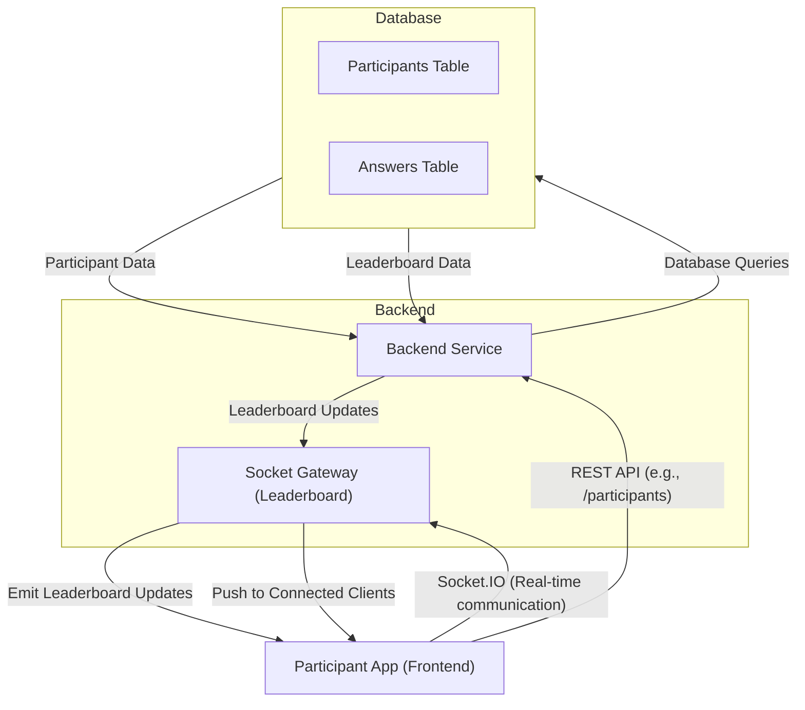
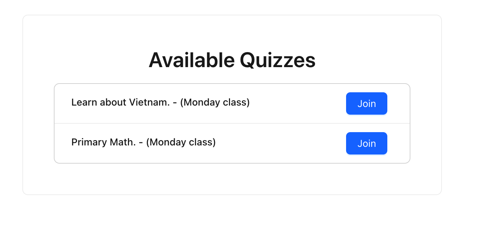
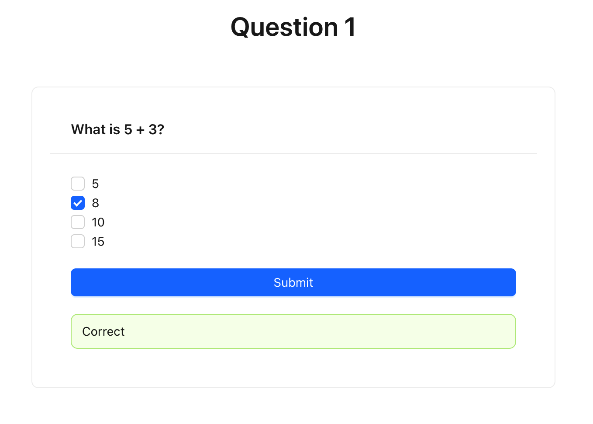
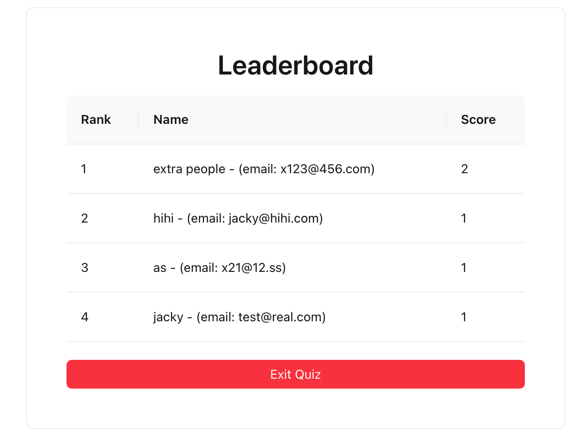

# Elsa Coding Challenge

## Demo

https://demo.slidegate.xyz/

## Solution

## Backend
### Todo and further enhancement
- Create Data object properly, especially for Data Response Object (currently all functions return `Promise<any>`)
- Separate Repository layer to decouple the model database
- Add log
- Add unit test
## Frontend

- Quiz Joining

- Quiz Answer

- Leaderboard

Leaderboard auto updated whenver an user answer single question and gain score:

### Todo and further enhancement
- We can add in another Frontend, let's call it `Elsa Host frontend`. The purpose is allow a host (probably teacher in this scenario) to update the quiz by themself. Once quiz is updated, or created a new quiz, they can create a session base on this and allow participant (student) to join the quiz.
- With websocket, we can implement real time quiz, where host can start the quiz when they want, and participant can only join the quiz when it is started.
- We can add timed out to each question, too.

